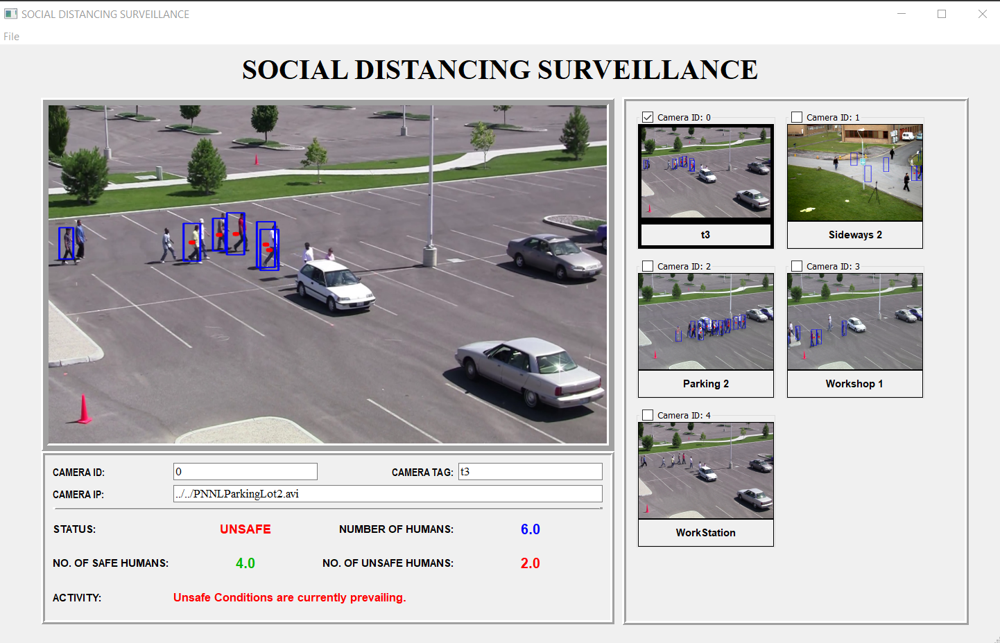
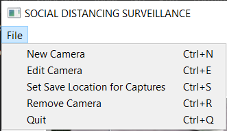
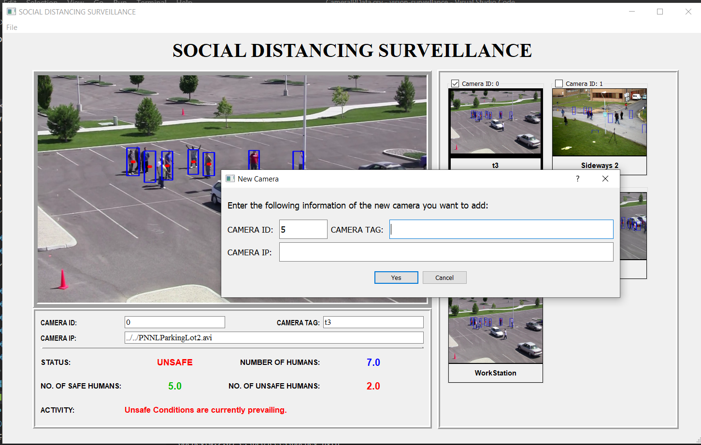
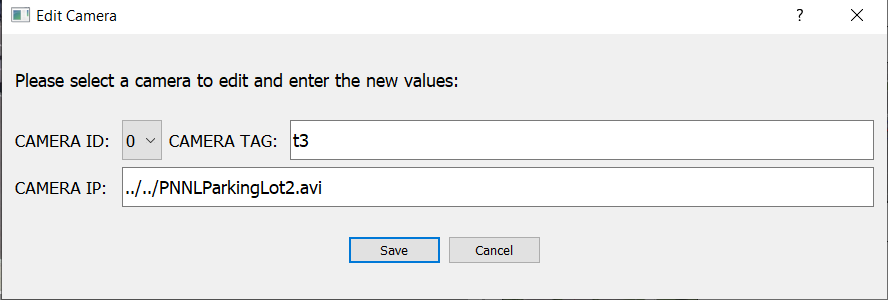

*NOTE: This repository is a clone of the original private repository of the project developed under TATA STEEL PRIVATE LIMITED during my internship and is only used for the purpose of showcasing my contribution towards the project.*

# Social Distancing Surveillance
This project aims to develop an end-to-end software to detect and raise alert on violations of social distancing norms by the employees in a workplace. The detection and analysis are to be done on the real-time streams being captured by the CCTV cameras in a workplace.

## Table of Contents
* [Introduction](#introduction)
* [Illustrations](#illustrations)
* [Technologies](#technologies)
* [Functionalities](#functionalities)
* [Setup](#setup)

## Introduction
With the outbreak of the Coronavirus pandemic all around the world, it has become mandatory to strictly follow the social distancing.  
In Offices, industrial plants and other workplaces are relatively close setting, with shared spaces like lobby, corridors, elevators & stairs, meeting rooms, cafeteria, parking places etc., the COVID-19 virus can spread relatively fast among employees, officials, staffs and visitors.  

Therefore, to ensure the social distancing is followed and maintained in workplaces, we take help of the growing technology advancements of Computer Vision and AI, to develop a system to monitor and track humans at a workplace/industrial plant via the live CCTV Surveillance in real-time and alert the authorities in-charge about any violations of social distancing in an area to take the necessary steps ahead.

## Illustrations
Snapshots of the Project after completion:
- Application  

- Menu Bar  
 

- New Camera  

- Edit Camera  

- Remove Camera  

## Technologies
The implementation of the project was done using the following programming languages and libraries:
- Python 3.5 or higher
- OpenCV
- Tensorflow 
- SciPy
- PyQt5
- Multiprocessing

## Functionalities
The following functionalities were implemented:
* __Stream Capture:__  
The real-time video/stream is captured by different CCTV’s cameras fixed at various locations. The live streams from these cameras are transmitted inside the TATA Steel Plat with the help of the Internet. For the exchange of these streams RTSP protocol is used.  
In our program, with the connection of the system to Plant’s Intranet, the stream of each camera is accessed with the help of a unique address/link assigned to each camera by the network which is presaved in a CSV file named "CameraIPData.csv" using OpenCV library in Python.  

* __Human Detection:__  
For Human Detection, a deep learning SSD (Single Shot Detector) object detection model from the TensorFlow Zoo for human detection.  
A captured frame is converted from RGB format to Grayscale format. Image processing is done using OpenCV library in the image to remove the unnecessary noise and highlight the significant objects in the frame and further this is fed to the SSD model.  
This model after detection returns the boundary coordinates of humans contours detected along with its accuracy/probability in the image. Using these coordinates, the centroid of each human contours is calculated. And further Euclidean distance is calculated between these centroids.  

* __Detection For Each Camera:__  
For detection and functioning on multiple cameras, the detection task for each cameras needs to run parallelly. For handling large number of cameras, it was mandatory that each cameras stream/video is processed in parallel i.e. the detection, pre-processing for all videos and calculation of distance, all should work in parallel. The deep learning model is also running in a separate parallel process. This was done using multiprocessing library of Python by assigning the above tasks for each camera in a separate process, all running parallelly. 

* __Multiprocessing Communication:__  
In any Operating System, each process is allocated it’s separate virtual memory. So, any two parallel processes can’t access the memory object of any other process. This functionality is there to prevent the Deadlock condition, which may arise when two memories access the same data.  
So, to transfer the frames from one child process to the process which executed the Deep Learning model, we needed to have some pipeline to enable such communication. Hence, to do this a few shared memories were allocated for different functionalities in the mother process, which could be accessible with all the processes.  

* __User Interface (UI):__  
In order for the end user to interact with the software in a smooth and efficient manner, a User Interface(UI) is designed to let user have the ease in use, having all the data and information presented and accessible at a single click.  
The UI is designed using a third-party python module PyQt5. PyQt5 is a set of Python v2 and v3 bindings for The Qt Company's Qt application framework and runs on all platforms supported by Qt including Windows, macOS, Linux, iOS and Android.  

## Setup
In order to run this project, 
- Install Python 3.5 or above installed in your system. To download the latest version of Python, [click here](https://www.python.org/downloads/)
- Install the necessary required libraries and its dependencies locally in the system, open Command Prompt and run:  
``pip install -r requirements.txt``
- Open Command Prompt at root folder of this project and run:  
``python3 main.py``
